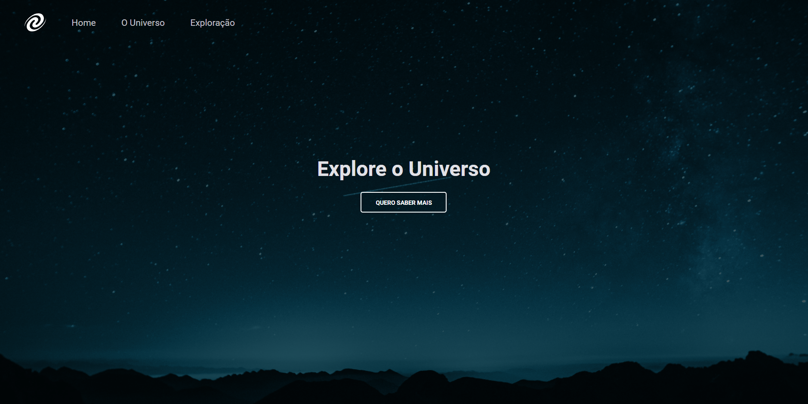

<h1 align="center"> SPA Universe </h1>

Aplicação desenvolvida no Stage 06 do programa Explorer da Rocketseat.

  <a href="#-tecnologias">Tecnologias</a>&nbsp;&nbsp;&nbsp;|&nbsp;&nbsp;&nbsp;
  <a href="#-projeto">Projeto</a>&nbsp;&nbsp;&nbsp;|&nbsp;&nbsp;&nbsp;
  <a href="#-layout">Layout</a>&nbsp;&nbsp;&nbsp;|&nbsp;&nbsp;&nbsp;
  <a href="#memo-licença">Licença</a>

  

 

  

## 🚀 Tecnologias

Esse projeto foi desenvolvido com as seguintes tecnologias:

- HTML e CSS
- JavaScript
- Conceitos de SPA
- Mapeamento de rotas
- Assíncrono e promises
- Orientação a objetos
- Git e Github

## 💻 Projeto

Página com informações sobre o universo utilizada para aplicar conceitos de Single Page Application.

## 🔖 Layout

Você pode visualizar o layout do projeto através [DESSE LINK](<https://www.figma.com/file/Q3937Mm0gYTuHoQhx74m7d/%5BDesafios-Explorer%5D-SPA-Universe-(Copy)?type=design&node-id=104-48&mode=design&t=0XuyLejC8j5ygsex-0>). É necessário ter conta no [Figma](https://figma.com) para acessá-lo.

## :memo: Licença

Esse projeto está sob a licença MIT.

---